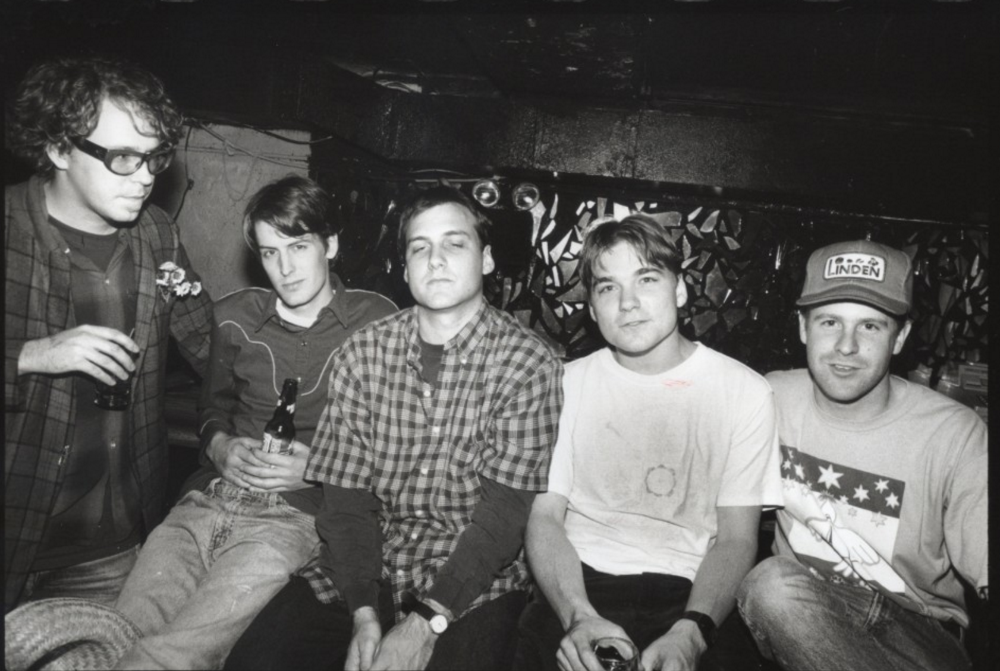

<!DOCTYPE html>
<head>
    
</head>

    

<ul class="NAVBAR">
<li><a href="#">
JOURNAL
</a></li>
<li><a href="#">
EXTRAS
</a></li>
<li><a href="#">
ARTICLES
</a></li>
</ul>

    

    <h2 style="font-family: 'Courier New', Courier, monospace; color: white;text-align: left;font-size: 30px;
    margin-left: 100px;
    margin-bottom: 50px; ;
    ">WHAT IS THIS?</h2>

 
    Lorem ipsum dolor sit amet, consectetur adipiscing elit. Integer pellentesque suscipit elementum. Aliquam quis viverra nisl, nec venenatis magna. 
    Donec vitae tempor nulla. Duis lobortis enim in mi fringilla, vitae dignissim nulla interdum. Vestibulum et placerat felis. Praesent a arcu viverra, eleifend elit non, bibendum tellus. Etiam enim tellus, maximus at massa sit amet, consectetur placerat dui. Sed in eros at mi mattis rhoncus. Mauris mollis diam ac augue gravida, vitae elementum nisi laoreet. Nulla interdum urna et purus congue ultrices.

    <h2 style="font-family: 'Courier New', Courier, monospace;font-size: 30px;color: white;text-align:right;
    margin-right: 100px;
    margin-bottom: 50px;
    "> ABOUT ME </h2>
    
 
       Lorem ipsum dolor sit amet, consectetur adipiscing elit. Integer pellentesque suscipit elementum. Aliquam quis viverra nisl, nec venenatis magna. Donec vitae tempor nulla. 
       Duis lobortis enim in mi fringilla, vitae dignissim nulla interdum. Vestibulum et placerat felis. Praesent a arcu viverra, eleifend elit non, bibendum tellus. Etiam enim tellus, maximus at massa sit amet, consectetur placerat dui. Sed in eros at mi mattis rhoncus. Mauris mollis diam ac augue gravida, vitae elementum nisi laoreet. Nulla interdum urna et purus congue ultrices.
    

    

    

    

<h2 style="font-family: 'Courier New', Courier, monospace;color: white;">UPCOMING PLANS</h2>

 NOTHING AS OF NOW

  
</body>
<a href="https://open.spotify.com/playlist/1xHUUzm8gVlpfJsAaavQ0L?si=8db8fe07a1314a39" target="_blank"</a>
   
BLANK

<footer class=line>
   
  
  <ul>
    <li><a href="#">
CONTACT ME
</a></li>
    <li><a href="#">
SOCIAL MEDIA
</a></li>
    <li><a href="#">
OTHERS
</a></li>
  </ul>
    
</footer>

    
